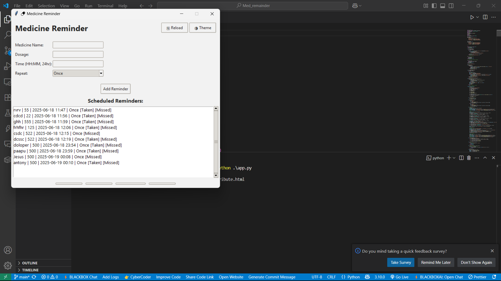
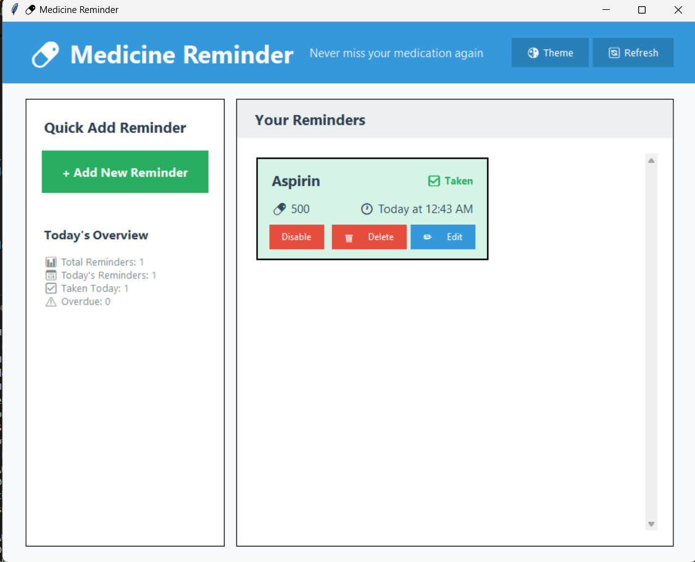

# 💊 Medicine Reminder

**Medicine Reminder** is a desktop application built using Python and Tkinter to help users stay on track with their medication schedule. It supports reminders via **alarm sound**, **email**, and **automated phone calls** using Twilio.

---

## 🚀 Features

- ⏰ Schedule reminders with medicine name, dosage, and time.
- 🔁 Repeat options: Once, Daily, Weekly, or Custom intervals.
- 🔔 Alerts via:
  - Alarm sound (plays a local MP3 file)
  - Email notification
  - Phone call using Twilio (reads out the reminder)
- 🌓 Light/Dark theme toggle
- 🛠️ System tray support (Windows only)
- 💾 Local persistence using `reminders.json`
- 💤 Snooze and mark reminders as taken

---

## 🖥️ Screenshots




---

## 📦 Requirements

- Python 3.7+
- Dependencies:
  - `tkinter`
  - `pygame`
  - `twilio`
  - `python-dotenv`
  - `pystray`
  - `Pillow`

Install them via pip:

```bash
pip install pygame twilio python-dotenv pystray Pillow
