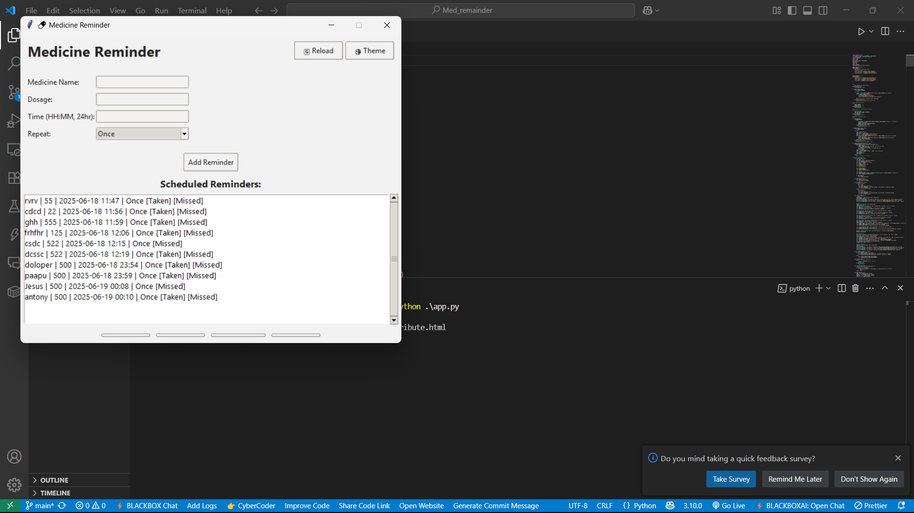
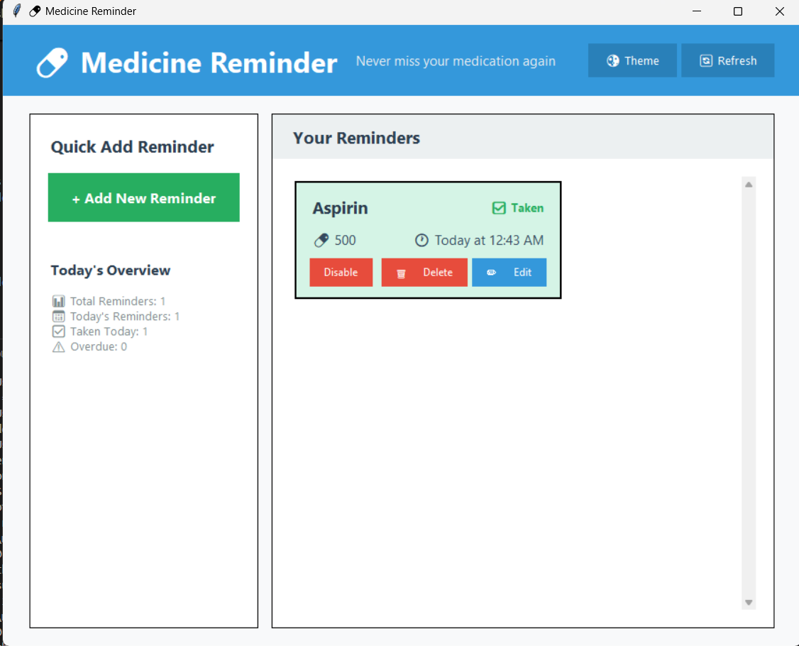

# 💊 Medicine Reminder

**Medicine Reminder** is a desktop application built using Python and Tkinter to help users stay on track with their medication schedule. It supports reminders via **alarm sound**, **email**, and **automated phone calls** using Twilio.

---

## 🚀 Features

- ⏰ Schedule reminders with medicine name, dosage, and time.
- 🔁 Repeat options: Once, Daily, Weekly, or Custom intervals.
- 🔔 Alerts via:
  - Alarm sound (plays a local MP3 file)
  - Email notification
  - Phone call using Twilio (reads out the reminder)
- 🌓 Light/Dark theme toggle
- 🛠️ System tray support (Windows only)
- 💾 Persistent storage using **MongoDB** (compatible with MongoDB Compass)
- 💤 Snooze and mark reminders as taken

---

## 🖥️ Screenshots




---

## 📦 Requirements

- Python 3.7+
- **MongoDB** (local instance or MongoDB Atlas)
  - Install [MongoDB Community Server](https://www.mongodb.com/try/download/community) for local use
  - View and manage data with [MongoDB Compass](https://www.mongodb.com/try/download/compass)
- Dependencies:
  - `tkinter`
  - `pygame`
  - `twilio`
  - `python-dotenv`
  - `pystray`
  - `Pillow`
  - `pymongo`

Install them via pip:

```bash
pip install pygame twilio python-dotenv pystray Pillow pymongo
```

---

## 🗄️ MongoDB Setup

Reminders are stored in a MongoDB database, which you can view and manage with [MongoDB Compass](https://www.mongodb.com/try/download/compass).

1. **Install and start MongoDB** (if running locally):
   - Download from [mongodb.com](https://www.mongodb.com/try/download/community) and follow the installation guide for your OS.
   - Start the MongoDB service (`mongod`).

2. **Configure the connection** in your `.env` file (copy `.env.example` to `.env`):
   ```
   MONGO_URI=mongodb://localhost:27017/
   ```
   To use a remote or Atlas connection, replace the value with your connection string, e.g.:
   ```
   MONGO_URI=mongodb+srv://<user>:<password>@cluster.mongodb.net/
   ```

3. **View data in MongoDB Compass**:
   - Open MongoDB Compass and connect using the same URI.
   - Navigate to the **`reminder_db`** database → **`reminders`** collection to see all stored reminders.

---
